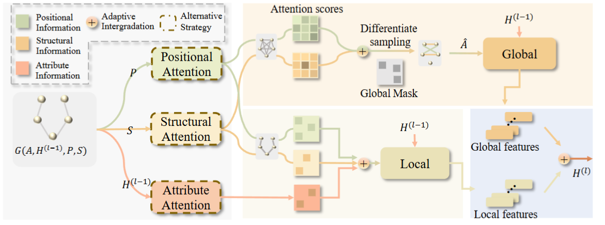

# Graph Triple Attention Networks: A Decoupled Perspective

> This repository is still on progress.

## Fast overview

Framework of DeGTA. The framework comprises four main components: Decoupled Multi-View Encoder, Local Channel, Global Channel, and Local-Global Integration. The strategies of encoders for multi-view and attention mechanism for local and global are all optional.

## Hyperparameters settings

 Experimental results are reported on the hyperparameter settings below, where we choose the settings that achieve the highest performance on the validation set. We choose hyperparameter grids that do not necessarily give optimal performance, but hopefully cover enough regimes so that each model is reasonably evaluated on each dataset.

- lr $\in \{5e-2,1e-2,5e-3,1e-3,5e-4\}$
- K $\in \{2,3,4,6,8,12\}$
- pe_dim $\in \{2,4,6,8,12,16\}$
- se_dim $\in \{2,4,6,8,12,16\}$
- ae_dim $\in \{32,64,128,256,512\}$
- dropout $\in \{0,0.1,0.2,0.3,0.5,0.8\}$
- weight_decay $\in \{1e-2,5e-3,1e-3,5e-4,1e-4\}$
- activation $\in \{\text{elu},\text{relu},\text{prelu}\}$
- layer_num $\in \{1,2,3,4,5,6,7,8\}$

## Runing Commands

The DeGTAConv is in  ./models/layer.py, and the DeGTA model is in ./models/model.py
